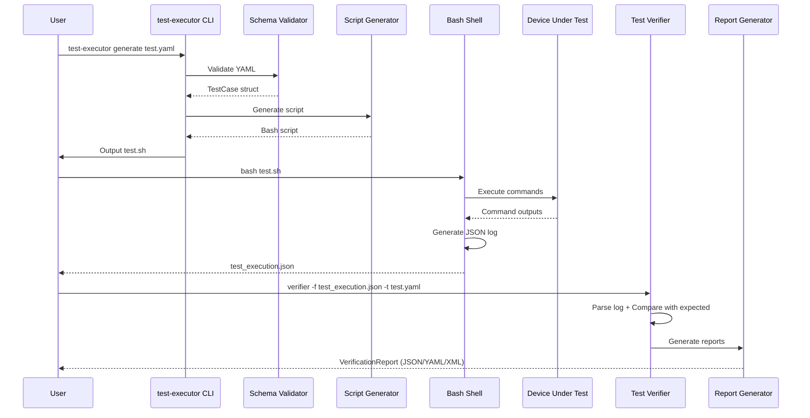
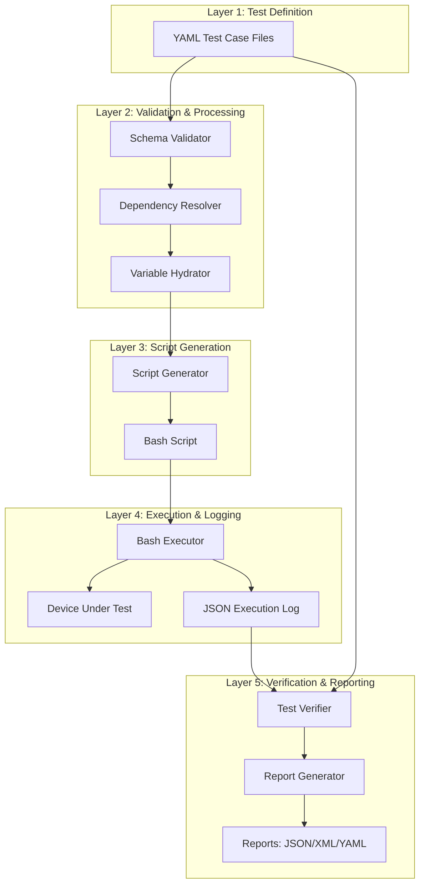
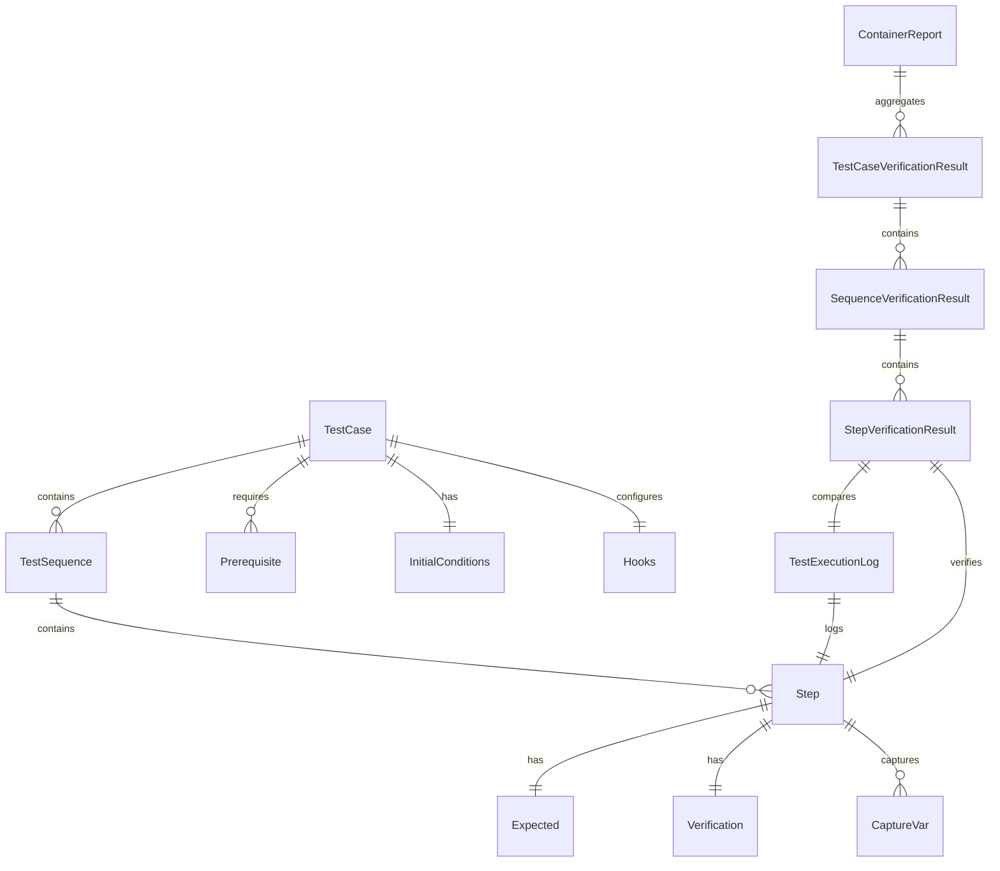

# Data Flow Architecture Documentation

## Table of Contents

1. [Overview](#overview)
2. [Core Data Models](#core-data-models)
3. [Layer-by-Layer Data Flow](#layer-by-layer-data-flow)
4. [Common Workflows](#common-workflows)
5. [Data Transformation Pipeline](#data-transformation-pipeline)
6. [Cross-Cutting Concerns](#cross-cutting-concerns)

---

## 1. Overview

### Five-Layer Architecture

The Test Case Management System (TCMS) follows a five-layer architecture that provides clear separation of concerns and well-defined data flows between components:

```
┌─────────────────────────────────────────────────────────────┐
│  Layer 1: Test Definition (YAML)                            │
│  - TestCase, TestSequence, Step definitions                 │
│  - Initial conditions, prerequisites, verification rules    │
└─────────────────────────────────────────────────────────────┘
                            ↓
┌─────────────────────────────────────────────────────────────┐
│  Layer 2: Validation & Processing                           │
│  - Schema validation, dependency resolution                 │
│  - Variable hydration, BDD parsing                          │
└─────────────────────────────────────────────────────────────┘
                            ↓
┌─────────────────────────────────────────────────────────────┐
│  Layer 3: Script Generation                                 │
│  - Bash script generation from TestCase                     │
│  - Verification logic embedding, hook integration           │
└─────────────────────────────────────────────────────────────┘
                            ↓
┌─────────────────────────────────────────────────────────────┐
│  Layer 4: Execution & Logging                               │
│  - Bash script execution, device interaction                │
│  - TestExecutionLog (JSON) generation                       │
└─────────────────────────────────────────────────────────────┘
                            ↓
┌─────────────────────────────────────────────────────────────┐
│  Layer 5: Verification & Reporting                          │
│  - Log verification against TestCase expectations           │
│  - VerificationReport, ContainerReport, JUnit XML output    │
└─────────────────────────────────────────────────────────────┘
```

### Data Flow Principles

1. **Immutable Source**: YAML test definitions remain unchanged during execution
2. **Unidirectional Flow**: Data flows from definition → execution → verification
3. **Traceability**: Each layer produces artifacts that link back to source
4. **Schema Adherence**: All data structures follow well-defined JSON schemas
5. **Audit Trail**: Operations are logged for compliance and debugging

### Key Artifacts at Each Layer

| Layer | Input Artifact | Output Artifact | Schema Location |
|-------|----------------|-----------------|-----------------|
| **Layer 1** | Human-authored YAML | TestCase struct | `schemas/testcase.schema.json` |
| **Layer 2** | TestCase YAML | Validated TestCase + dependencies | N/A (in-memory) |
| **Layer 3** | TestCase struct | Bash script (.sh) | N/A (script) |
| **Layer 4** | Bash script | TestExecutionLog JSON | `schemas/test_execution_log.schema.json` |
| **Layer 5** | TestExecutionLog + TestCase | VerificationReport, ContainerReport, JUnit XML | `schemas/container_report.schema.json` |

---

## 2. Core Data Models

The following table describes the primary data structures used throughout the system, organized by their source crate and primary purpose.

### Test Definition Models

| Model | Source Crate | Key Fields | Description |
|-------|--------------|------------|-------------|
| **TestCase** | `testcase-models` | `requirement`, `item`, `tc`, `id`, `description`, `test_sequences`, `initial_conditions`, `hydration_vars`, `hooks` | Root test case definition containing metadata, sequences, and configuration |
| **TestSequence** | `testcase-models` | `id`, `name`, `description`, `steps`, `initial_conditions`, `variables` | A sequence of test steps with scoped variables and conditions |
| **Step** | `testcase-models` | `step`, `description`, `command`, `expected`, `verification`, `manual`, `capture_vars` | Individual test step with command, expectations, and verification logic |
| **Expected** | `testcase-models` | `success`, `result`, `output` | Expected outcomes for step execution |
| **Verification** | `testcase-models` | `result`, `output`, `output_file`, `general` | Verification expressions (simple or conditional) for validating step execution |

### Execution & Logging Models

| Model | Source Crate | Key Fields | Description |
|-------|--------------|------------|-------------|
| **TestExecutionLog** | `testcase-verification` | `test_case_id`, `sequence_id`, `step_number`, `success`, `actual_result`, `actual_output`, `timestamp`, `source_yaml_sha256` | Parsed execution log entry with actual results |
| **TestStepExecutionEntry** | `testcase-models` | `test_sequence`, `step`, `command`, `exit_code`, `output`, `result_verification_pass`, `output_verification_pass`, `timestamp`, `hook_type` | Raw execution log entry as generated by bash script |
| **ActualResult** | `testcase-models` | `result`, `output`, `success` | Actual results from step execution |

### Verification & Reporting Models

| Model | Source Crate | Key Fields | Description |
|-------|--------------|------------|-------------|
| **StepVerificationResult** | `testcase-verification` | `step_number`, `passed`, `result_match`, `output_match`, `success_match`, `diff` | Detailed verification result for a single step |
| **StepVerificationResultEnum** | `testcase-verification` | Variants: `Pass`, `Fail`, `NotExecuted` each with metadata | Enum-based step result for batch verification and reporting |
| **VerificationReport** | `testcase-models` | `total_steps`, `passed_steps`, `failed_steps`, `skipped_steps`, `step_results`, `overall_status` | Summary report of verification results |
| **ContainerReport** | `testcase-verification` | `title`, `project`, `test_date`, `environment`, `test_cases`, `summary` | Multi-test case container report with metadata |
| **TestCaseVerificationResult** | `testcase-verification` | `test_case_id`, `description`, `sequences`, `total_steps`, `passed_steps`, `failed_steps`, `overall_passed` | Complete verification result for a test case |

### Configuration & Metadata Models

| Model | Source Crate | Key Fields | Description |
|-------|--------------|------------|-------------|
| **InitialConditions** | `testcase-models` | `include`, `devices` (device-keyed condition arrays) | Device-specific initial conditions with dependency includes |
| **Prerequisite** | `testcase-models` | `prerequisite_type`, `description`, `verification_command` | Manual or automatic prerequisite that must be satisfied |
| **EnvVariable** | `testcase-models` | `name`, `description`, `default_value`, `required` | Environment variable definition for hydration |
| **Hooks** | `testcase-models` | `script_start`, `setup_test`, `before_sequence`, `after_sequence`, `before_step`, `after_step`, `teardown_test`, `script_end` | Lifecycle hooks for test execution |
| **CaptureVar** | `testcase-models` | `name`, `capture`, `command` | Variable capture configuration (regex or command-based) |

---

## 3. Layer-by-Layer Data Flow

### Layer 1: Test Definition (YAML)

**Responsibility**: Store human-readable test case definitions with all metadata, steps, and verification logic.

**Data Models**:
- Input: Human-authored YAML files
- Output: `TestCase` struct deserialized from YAML

**Example YAML Structure**:
```yaml
type: testcase
schema: https://example.com/schemas/testcase.schema.json
requirement: XXX100
item: 1
tc: 4
id: 4.2.2.2.1_test
description: Test basic functionality

general_initial_conditions:
  eUICC:
    - "Condition 1"
    - "Condition 2"

initial_conditions:
  eUICC:
    - "Device ready"

test_sequences:
  - id: 1
    name: "Basic Test"
    description: "Test sequence description"
    steps:
      - step: 1
        description: "Execute command"
        command: "echo 'Hello'"
        expected:
          result: "0"
          output: "Hello"
        verification:
          result: "[[ $? -eq 0 ]]"
          output: "cat $COMMAND_OUTPUT | grep -q 'Hello'"
```

**Data Transformation**: YAML → `serde_yaml` → `TestCase` struct

**Code Example**:
```rust
use testcase_models::TestCase;
use std::fs;

let yaml_content = fs::read_to_string("test.yaml")?;
let test_case: TestCase = serde_yaml::from_str(&yaml_content)?;
```

---

### Layer 2: Validation & Processing

**Responsibility**: Validate test definitions against schemas, resolve dependencies, and prepare for execution.

**Components**:
- **Schema Validation** (`validate-yaml`, `testcase-validation`)
- **Dependency Resolution** (`testcase-validation::DependencyResolver`)
- **Variable Hydration** (`testcase-execution::VarHydrator`)
- **BDD Parsing** (`testcase-execution::bdd_parser`)

**Data Flow**:

```
TestCase YAML → JSON Schema Validation → Dependency Resolution → Variable Hydration → Processed TestCase
```

**Example: Schema Validation**:
```rust
use testcase_validation::SchemaValidator;

let validator = SchemaValidator::new()?;
let validation_result = validator.validate_file("test.yaml")?;

if validation_result.is_valid() {
    println!("Test case is valid");
} else {
    for error in validation_result.errors {
        eprintln!("Validation error: {}", error);
    }
}
```

**Example: Dependency Resolution**:
```rust
use testcase_validation::DependencyResolver;
use testcase_storage::TestCaseStorage;

let storage = TestCaseStorage::new("./testcases")?;
let resolver = DependencyResolver::new(&storage);

// Resolve includes in initial_conditions
let resolved_conditions = resolver.resolve_initial_conditions(
    &test_case.initial_conditions,
    &test_case.id
)?;
```

**Example: Variable Hydration**:
```rust
use testcase_execution::VarHydrator;
use std::collections::HashMap;

let mut hydrator = VarHydrator::new();
hydrator.load_from_file(".env")?;

// Hydrate environment variables in test case
let hydrated_test_case = hydrator.hydrate_test_case(&test_case)?;
```

**Data Transformation**:
- Input: Raw `TestCase` from YAML
- Output: Validated and enriched `TestCase` ready for script generation

---

### Layer 3: Script Generation

**Responsibility**: Transform validated `TestCase` into executable bash scripts with embedded verification logic.

**Component**: `test-executor` crate, `TestExecutor` struct

**Data Flow**:

```
TestCase → Script Template → Bash Script with:
  - Setup code
  - Step execution loops
  - Verification logic
  - JSON log generation
  - Hook invocations
```

**Script Structure**:
```bash
#!/bin/bash
# Generated from: test.yaml
# Test Case ID: 4.2.2.2.1_test

set -euo pipefail

# Setup
SCRIPT_DIR="$(cd "$(dirname "${BASH_SOURCE[0]}")" && pwd)"
LOG_FILE="test_execution.log"
JSON_LOG="test_execution.json"

# Initialize JSON log
echo "[" > "$JSON_LOG"

# Hook: script_start
if [[ -n "${HOOK_SCRIPT_START:-}" ]]; then
    bash "$HOOK_SCRIPT_START"
fi

# Test Sequence 1
SEQUENCE_ID=1

# Step 1
STEP_NUM=1
COMMAND="echo 'Hello'"

# Execute command
COMMAND_OUTPUT=$(mktemp)
$COMMAND > "$COMMAND_OUTPUT" 2>&1
EXIT_CODE=$?

# Verification
RESULT_VERIFICATION_PASS=false
OUTPUT_VERIFICATION_PASS=false

if [[ $? -eq 0 ]]; then
    RESULT_VERIFICATION_PASS=true
fi

if cat $COMMAND_OUTPUT | grep -q 'Hello'; then
    OUTPUT_VERIFICATION_PASS=true
fi

# Log to JSON
cat >> "$JSON_LOG" << EOF
{
  "test_sequence": $SEQUENCE_ID,
  "step": $STEP_NUM,
  "command": "$COMMAND",
  "exit_code": $EXIT_CODE,
  "output": "$(cat $COMMAND_OUTPUT | json-escape)",
  "timestamp": "$(date -u +"%Y-%m-%dT%H:%M:%SZ")",
  "result_verification_pass": $RESULT_VERIFICATION_PASS,
  "output_verification_pass": $OUTPUT_VERIFICATION_PASS
}
EOF

# Cleanup
rm -f "$COMMAND_OUTPUT"

# Finalize JSON log
echo "]" >> "$JSON_LOG"
```

**Code Example**:
```rust
use testcase_execution::TestExecutor;
use std::path::Path;

let executor = TestExecutor::new();
let test_case = load_test_case("test.yaml")?;

// Generate bash script
let script_content = executor.generate_script(&test_case)?;

// Write to file
std::fs::write("test.sh", script_content)?;
```

**Data Transformation**:
- Input: `TestCase` struct
- Output: Bash script string (`.sh` file)

---

### Layer 4: Execution & Logging

**Responsibility**: Execute generated bash scripts and capture structured execution logs in JSON format.

**Components**:
- Bash shell (external)
- JSON log generation (embedded in script)
- Device Under Test (DUT) interaction

**Data Flow**:

```
Bash Script → Command Execution → DUT Interaction → TestStepExecutionEntry → JSON Log Array
```

**Execution Modes**:
1. **Automatic Execution**: All non-manual steps executed automatically
2. **Manual Execution**: User prompted to execute manual steps interactively
3. **Mixed Execution**: Combination of automatic and manual steps

**JSON Log Format** (`TestStepExecutionEntry`):
```json
[
  {
    "test_sequence": 1,
    "step": 1,
    "command": "echo 'Hello'",
    "exit_code": 0,
    "output": "Hello\n",
    "timestamp": "2024-01-20T10:30:00Z",
    "result_verification_pass": true,
    "output_verification_pass": true
  },
  {
    "test_sequence": 1,
    "step": 2,
    "command": "test -f /tmp/file",
    "exit_code": 1,
    "output": "",
    "timestamp": "2024-01-20T10:30:05Z",
    "result_verification_pass": false,
    "output_verification_pass": true
  }
]
```

**Hook Execution**: Hooks are executed at specific lifecycle points:
- `script_start`: Before any test execution
- `setup_test`: Before test setup
- `before_sequence`: Before each test sequence
- `before_step`: Before each step
- `after_step`: After each step
- `after_sequence`: After each sequence
- `teardown_test`: After test teardown
- `script_end`: After all test execution

**Hook Log Entry**:
```json
{
  "test_sequence": 1,
  "step": 0,
  "command": "/path/to/hook.sh",
  "exit_code": 0,
  "output": "Hook executed successfully",
  "timestamp": "2024-01-20T10:29:55Z",
  "hook_type": "script_start",
  "hook_path": "/path/to/hook.sh",
  "result_verification_pass": true,
  "output_verification_pass": true
}
```

**Data Transformation**:
- Input: Bash script (`.sh`)
- Output: JSON log array (`TestStepExecutionEntry[]`)

---

### Layer 5: Verification & Reporting

**Responsibility**: Verify execution logs against expected results and generate comprehensive reports.

**Components**:
- `testcase-verification::TestVerifier`
- `verifier` binary
- Report generators (JSON, YAML, XML)

**Data Flow**:

```
TestExecutionLog + TestCase → Verification → StepVerificationResult → VerificationReport → ContainerReport → JUnit XML
```

**Verification Process**:

1. **Parse Execution Log**: Load JSON log into `TestExecutionLog` structs
2. **Match Steps**: Align executed steps with expected steps from `TestCase`
3. **Compare Results**: Verify `actual_result` vs `expected.result`
4. **Compare Output**: Verify `actual_output` vs `expected.output`
5. **Aggregate Results**: Compute overall pass/fail status
6. **Generate Reports**: Create reports in multiple formats

**Code Example**:
```rust
use testcase_verification::TestVerifier;

let verifier = TestVerifier::new();
let test_case = load_test_case("test.yaml")?;
let execution_log = verifier.parse_execution_log("test_execution.json")?;

// Verify test execution
let verification_result = verifier.verify_execution(
    &test_case,
    &execution_log
)?;

// Generate report
let report = verifier.generate_report(&verification_result)?;

println!("Overall: {}", report.overall_status);
println!("Passed: {}/{}", report.passed_steps, report.total_steps);
```

**Verification Result Structure** (`TestCaseVerificationResult`):
```rust
pub struct TestCaseVerificationResult {
    pub test_case_id: String,
    pub description: String,
    pub sequences: Vec<SequenceVerificationResult>,
    pub total_steps: usize,
    pub passed_steps: usize,
    pub failed_steps: usize,
    pub not_executed_steps: usize,
    pub overall_passed: bool,
}

pub struct SequenceVerificationResult {
    pub sequence_id: i64,
    pub name: String,
    pub step_results: Vec<StepVerificationResultEnum>,
    pub all_passed: bool,
}

pub enum StepVerificationResultEnum {
    Pass {
        step: i64,
        description: String,
        requirement: Option<String>,
        item: Option<i64>,
        tc: Option<i64>,
    },
    Fail {
        step: i64,
        description: String,
        expected: Expected,
        actual_result: String,
        actual_output: String,
        reason: String,
        requirement: Option<String>,
        item: Option<i64>,
        tc: Option<i64>,
    },
    NotExecuted {
        step: i64,
        description: String,
        requirement: Option<String>,
        item: Option<i64>,
        tc: Option<i64>,
    },
}
```

**Container Report** (multi-test case):
```json
{
  "type": "test_report",
  "schema": "https://example.com/schemas/container_report.schema.json",
  "title": "Test Execution Report",
  "project": "eUICC Testing",
  "test_date": "2024-01-20",
  "environment": "QA",
  "platform": "Linux x86_64",
  "test_cases": [
    {
      "test_case_id": "4.2.2.2.1_test",
      "description": "Test basic functionality",
      "sequences": [...],
      "total_steps": 10,
      "passed_steps": 8,
      "failed_steps": 2,
      "not_executed_steps": 0,
      "overall_passed": false
    }
  ],
  "summary": {
    "total_test_cases": 1,
    "passed_test_cases": 0,
    "failed_test_cases": 1,
    "total_steps": 10,
    "passed_steps": 8,
    "failed_steps": 2
  }
}
```

**JUnit XML Output**:
```xml
<?xml version="1.0" encoding="UTF-8"?>
<testsuites>
  <testsuite name="4.2.2.2.1_test" tests="10" failures="2" errors="0" time="5.230">
    <testcase name="Sequence 1 - Step 1: Execute command" time="0.523">
      <!-- Pass -->
    </testcase>
    <testcase name="Sequence 1 - Step 2: Test file exists" time="0.102">
      <failure message="Expected result '0' but got '1'">
        Verification failed: result mismatch
        Expected: 0
        Actual: 1
      </failure>
    </testcase>
    <!-- ... more test cases ... -->
  </testsuite>
</testsuites>
```

**Data Transformation**:
- Input: `TestExecutionLog[]` + `TestCase`
- Output: `VerificationReport`, `ContainerReport`, JUnit XML

---

## 4. Common Workflows

### 4.1 End-to-End Test Execution Workflow

**Step-by-Step Data Flow**:



**Code Example - Complete Workflow**:

```rust
use testcase_common::load_and_validate_yaml;
use testcase_execution::TestExecutor;
use testcase_verification::TestVerifier;
use std::process::Command;

// Step 1: Load and validate test case
let test_case = load_and_validate_yaml("test.yaml")?;

// Step 2: Generate bash script
let executor = TestExecutor::new();
let script = executor.generate_script(&test_case)?;
std::fs::write("test.sh", script)?;

// Step 3: Execute script
let output = Command::new("bash")
    .arg("test.sh")
    .output()?;

if !output.status.success() {
    eprintln!("Script execution failed");
}

// Step 4: Verify execution
let verifier = TestVerifier::new();
let log_entries = verifier.parse_execution_log("test_execution.json")?;
let verification_result = verifier.verify_execution(&test_case, &log_entries)?;

// Step 5: Generate reports
let json_report = verifier.to_json(&verification_result)?;
std::fs::write("verification_report.json", json_report)?;

let junit_xml = verifier.to_junit_xml(&verification_result)?;
std::fs::write("junit_report.xml", junit_xml)?;

println!("Verification complete: {}", verification_result.overall_passed);
```

---

### 4.2 Manual Step Execution Workflow

**Manual steps** require human interaction and are handled differently from automated steps.

**Data Flow**:

```
TestCase with manual=true → Script Generation (with prompts) → User Interaction → Manual Result Capture → JSON Log
```

**TestCase YAML with Manual Step**:
```yaml
test_sequences:
  - id: 1
    name: "Manual Test"
    steps:
      - step: 1
        manual: true
        description: "Visually inspect display"
        command: "manual_inspection"
        expected:
          result: "pass"
          output: "Display shows correct information"
        verification:
          result: "[[ \"$MANUAL_RESULT\" == \"pass\" ]]"
          output: "true"
```

**Generated Script Segment**:
```bash
# Step 1 (Manual)
STEP_NUM=1
echo "=== Manual Step $STEP_NUM ==="
echo "Description: Visually inspect display"
echo ""
echo "Please perform the manual action and enter the result:"
read -p "Result (pass/fail): " MANUAL_RESULT
read -p "Output/Notes: " MANUAL_OUTPUT

# Verification
RESULT_VERIFICATION_PASS=false
if [[ "$MANUAL_RESULT" == "pass" ]]; then
    RESULT_VERIFICATION_PASS=true
fi

# Log to JSON
cat >> "$JSON_LOG" << EOF
{
  "test_sequence": 1,
  "step": 1,
  "command": "manual_inspection",
  "exit_code": 0,
  "output": "$MANUAL_OUTPUT",
  "timestamp": "$(date -u +"%Y-%m-%dT%H:%M:%SZ")",
  "result_verification_pass": $RESULT_VERIFICATION_PASS,
  "output_verification_pass": true
}
EOF
```

**Key Differences**:
- No actual command execution
- User prompted for result and output
- Verification based on user input
- JSON log captures user-provided data

---

### 4.3 Variable Capture and Passing Workflow

**Variables** can be captured from step output and used in subsequent steps.

**Data Flow**:

```
Step Execution → Output Capture (regex/command) → Variable Storage → Variable Substitution in Next Steps
```

**TestCase YAML with Variable Capture**:
```yaml
test_sequences:
  - id: 1
    name: "Variable Test"
    steps:
      - step: 1
        description: "Get session ID"
        command: "login.sh"
        capture_vars:
          - name: SESSION_ID
            capture: "Session ID: ([A-Z0-9]+)"
        expected:
          result: "0"
          output: "Login successful"
      
      - step: 2
        description: "Use session ID"
        command: "query.sh ${SESSION_ID}"
        expected:
          result: "0"
          output: "Query successful"
```

**Generated Script Logic**:
```bash
# Step 1: Capture SESSION_ID
COMMAND_OUTPUT=$(mktemp)
login.sh > "$COMMAND_OUTPUT" 2>&1
EXIT_CODE=$?

# Capture variable
SESSION_ID=$(cat "$COMMAND_OUTPUT" | grep -oP "Session ID: \K[A-Z0-9]+")
export SESSION_ID

# Step 2: Use captured variable
query.sh ${SESSION_ID}
```

**Alternative: Command-based Capture**:
```yaml
capture_vars:
  - name: TIMESTAMP
    command: "date +%s"
```

```bash
# Execute capture command
TIMESTAMP=$(date +%s)
export TIMESTAMP
```

---

### 4.4 Batch Verification Workflow

**Batch verification** processes multiple test execution logs in a single pass.

**Data Flow**:

```
Multiple TestExecutionLog files → Batch Parser → Parallel Verification → ContainerReport
```

**Code Example**:
```rust
use testcase_verification::TestVerifier;
use std::path::PathBuf;

let verifier = TestVerifier::new();
let log_dir = PathBuf::from("./logs");

// Discover all execution logs
let log_files = verifier.discover_logs(&log_dir)?;

// Batch verify
let results = verifier.batch_verify(&log_files, "./testcases")?;

// Generate container report
let container_report = verifier.generate_container_report(
    &results,
    "Test Campaign Report",
    "eUICC Project"
)?;

// Export to JSON
let json = serde_json::to_string_pretty(&container_report)?;
std::fs::write("container_report.json", json)?;
```

**ContainerReport Structure**:
```rust
pub struct ContainerReport {
    pub doc_type: Option<String>,
    pub schema: Option<String>,
    pub title: String,
    pub project: String,
    pub test_date: String,
    pub environment: Option<String>,
    pub platform: Option<String>,
    pub executor: Option<String>,
    pub test_cases: Vec<TestCaseVerificationResult>,
    pub summary: ReportSummary,
}

pub struct ReportSummary {
    pub total_test_cases: usize,
    pub passed_test_cases: usize,
    pub failed_test_cases: usize,
    pub total_steps: usize,
    pub passed_steps: usize,
    pub failed_steps: usize,
    pub execution_time: Option<f64>,
}
```

---

## 5. Data Transformation Pipeline

This section traces the complete data transformation from YAML to final reports.

### 5.1 YAML → TestCase Struct

**Transformation**: Text file → Rust struct via `serde_yaml`

**Input** (YAML):
```yaml
requirement: XXX100
item: 1
tc: 4
id: 4.2.2.2.1_test
description: Test case
test_sequences:
  - id: 1
    name: "Seq 1"
    description: "Sequence"
    steps:
      - step: 1
        description: "Step 1"
        command: "echo test"
        expected:
          result: "0"
          output: "test"
```

**Output** (Rust struct):
```rust
TestCase {
    doc_type: None,
    schema: None,
    requirement: "XXX100".to_string(),
    item: 1,
    tc: 4,
    id: "4.2.2.2.1_test".to_string(),
    description: "Test case".to_string(),
    prerequisites: None,
    general_initial_conditions: InitialConditions::default(),
    initial_conditions: InitialConditions::default(),
    test_sequences: vec![
        TestSequence {
            id: 1,
            name: "Seq 1".to_string(),
            description: "Sequence".to_string(),
            variables: None,
            initial_conditions: InitialConditions::default(),
            steps: vec![
                Step {
                    step: 1,
                    manual: None,
                    description: "Step 1".to_string(),
                    command: "echo test".to_string(),
                    capture_vars: None,
                    expected: Expected {
                        success: None,
                        result: "0".to_string(),
                        output: "test".to_string(),
                    },
                    verification: Verification {
                        result: VerificationExpression::Simple("[[ $? -eq 0 ]]".to_string()),
                        output: VerificationExpression::Simple("cat $COMMAND_OUTPUT | grep -q 'test'".to_string()),
                        output_file: None,
                        general: None,
                    },
                    reference: None,
                }
            ],
            reference: None,
        }
    ],
    hydration_vars: None,
    hooks: None,
}
```

**Transformation Code**:
```rust
let yaml_content = std::fs::read_to_string("test.yaml")?;
let test_case: TestCase = serde_yaml::from_str(&yaml_content)?;
```

---

### 5.2 TestCase → Bash Script

**Transformation**: Rust struct → Bash script text via `TestExecutor`

**Input**: `TestCase` struct (from above)

**Output** (Bash script):
```bash
#!/bin/bash
set -euo pipefail

# Generated from: test.yaml
# Test Case ID: 4.2.2.2.1_test

SCRIPT_DIR="$(cd "$(dirname "${BASH_SOURCE[0]}")" && pwd)"
JSON_LOG="test_execution.json"

echo "[" > "$JSON_LOG"

# Test Sequence 1: Seq 1
SEQUENCE_ID=1

# Step 1: Step 1
STEP_NUM=1
COMMAND="echo test"

COMMAND_OUTPUT=$(mktemp)
$COMMAND > "$COMMAND_OUTPUT" 2>&1
EXIT_CODE=$?

# Verification
RESULT_VERIFICATION_PASS=false
OUTPUT_VERIFICATION_PASS=false

if [[ $? -eq 0 ]]; then
    RESULT_VERIFICATION_PASS=true
fi

if cat $COMMAND_OUTPUT | grep -q 'test'; then
    OUTPUT_VERIFICATION_PASS=true
fi

# Log entry
cat >> "$JSON_LOG" << EOF
{
  "test_sequence": $SEQUENCE_ID,
  "step": $STEP_NUM,
  "command": "$COMMAND",
  "exit_code": $EXIT_CODE,
  "output": "$(cat $COMMAND_OUTPUT | json-escape)",
  "timestamp": "$(date -u +"%Y-%m-%dT%H:%M:%SZ")",
  "result_verification_pass": $RESULT_VERIFICATION_PASS,
  "output_verification_pass": $OUTPUT_VERIFICATION_PASS
}
EOF

rm -f "$COMMAND_OUTPUT"

echo "]" >> "$JSON_LOG"
```

**Transformation Code**:
```rust
use testcase_execution::TestExecutor;

let executor = TestExecutor::new();
let script = executor.generate_script(&test_case)?;
std::fs::write("test.sh", script)?;
```

---

### 5.3 Bash Script → JSON Log

**Transformation**: Script execution → JSON array of `TestStepExecutionEntry`

**Input**: Bash script execution

**Output** (JSON):
```json
[
  {
    "test_sequence": 1,
    "step": 1,
    "command": "echo test",
    "exit_code": 0,
    "output": "test\n",
    "timestamp": "2024-01-20T10:30:00Z",
    "result_verification_pass": true,
    "output_verification_pass": true
  }
]
```

**Execution**:
```bash
bash test.sh
# Produces test_execution.json
```

---

### 5.4 JSON Log → TestExecutionLog

**Transformation**: JSON file → Parsed Rust structs

**Input**: JSON array (from above)

**Output** (Rust structs):
```rust
vec![
    TestExecutionLog {
        test_case_id: "4.2.2.2.1_test".to_string(),
        sequence_id: 1,
        step_number: 1,
        success: Some(true),
        actual_result: "0".to_string(),
        actual_output: "test\n".to_string(),
        timestamp: Some(DateTime::parse_from_rfc3339("2024-01-20T10:30:00Z")?),
        log_file_path: PathBuf::from("test_execution.json"),
        result_verification_pass: Some(true),
        output_verification_pass: Some(true),
        source_yaml_sha256: None,
    }
]
```

**Transformation Code**:
```rust
use testcase_verification::TestVerifier;

let verifier = TestVerifier::new();
let log_entries = verifier.parse_execution_log("test_execution.json")?;
```

---

### 5.5 TestExecutionLog + TestCase → VerificationReport

**Transformation**: Execution logs + Expected results → Verification report

**Input**:
- `TestExecutionLog` (actual results)
- `TestCase` (expected results)

**Output** (`TestCaseVerificationResult`):
```rust
TestCaseVerificationResult {
    test_case_id: "4.2.2.2.1_test".to_string(),
    description: "Test case".to_string(),
    sequences: vec![
        SequenceVerificationResult {
            sequence_id: 1,
            name: "Seq 1".to_string(),
            step_results: vec![
                StepVerificationResultEnum::Pass {
                    step: 1,
                    description: "Step 1".to_string(),
                    requirement: Some("XXX100".to_string()),
                    item: Some(1),
                    tc: Some(4),
                }
            ],
            all_passed: true,
        }
    ],
    total_steps: 1,
    passed_steps: 1,
    failed_steps: 0,
    not_executed_steps: 0,
    overall_passed: true,
}
```

**Transformation Code**:
```rust
let verification_result = verifier.verify_execution(&test_case, &log_entries)?;
```

---

### 5.6 VerificationReport → XML Report

**Transformation**: Verification results → JUnit XML format

**Input**: `TestCaseVerificationResult`

**Output** (XML):
```xml
<?xml version="1.0" encoding="UTF-8"?>
<testsuites>
  <testsuite name="4.2.2.2.1_test" tests="1" failures="0" errors="0" time="0.523">
    <testcase name="Sequence 1 - Step 1: Step 1" time="0.523">
      <!-- Pass: No failure element -->
    </testcase>
  </testsuite>
</testsuites>
```

**Transformation Code**:
```rust
let junit_xml = verifier.to_junit_xml(&verification_result)?;
std::fs::write("junit_report.xml", junit_xml)?;
```

---

## 6. Cross-Cutting Concerns

### 6.1 Audit Logging

**Purpose**: Track all operations for compliance, debugging, and traceability.

**Audit Log Model** (`audit-verifier` crate):
```rust
pub struct AuditLogEntry {
    pub timestamp: DateTime<Utc>,
    pub operation: String,
    pub operation_type: OperationType,
    pub status: OperationStatus,
    pub user: Option<String>,
    pub details: HashMap<String, String>,
    pub integrity: AuditIntegrity,
}

pub enum OperationType {
    TestExecution,
    ScriptGeneration,
    Verification,
    ReportGeneration,
}

pub enum OperationStatus {
    Success,
    Failure,
    Partial,
}

pub struct AuditIntegrity {
    pub previous_hash: Option<String>,
    pub current_hash: String,
    pub signature: Option<String>,
}
```

**Audit Flow**:

```
Operation → Audit Logger → Audit Log Entry → Cryptographic Chain → audit.log.json
```

**Code Example**:
```rust
use audit_verifier::audit_log::{AuditLog, AuditLogEntry, OperationType, OperationStatus};

let mut audit_log = AuditLog::new("audit.log.json")?;

// Log script generation
audit_log.log_operation(
    "generate_script",
    OperationType::ScriptGeneration,
    OperationStatus::Success,
    Some("user123"),
    [
        ("test_case_id", "4.2.2.2.1_test"),
        ("output_file", "test.sh"),
    ]
)?;

// Log test execution
audit_log.log_operation(
    "execute_test",
    OperationType::TestExecution,
    OperationStatus::Success,
    Some("user123"),
    [
        ("test_case_id", "4.2.2.2.1_test"),
        ("execution_log", "test_execution.json"),
    ]
)?;
```

**Audit Log JSON**:
```json
[
  {
    "timestamp": "2024-01-20T10:30:00Z",
    "operation": "generate_script",
    "operation_type": "ScriptGeneration",
    "status": "Success",
    "user": "user123",
    "details": {
      "test_case_id": "4.2.2.2.1_test",
      "output_file": "test.sh"
    },
    "integrity": {
      "previous_hash": null,
      "current_hash": "a1b2c3d4...",
      "signature": null
    }
  },
  {
    "timestamp": "2024-01-20T10:35:00Z",
    "operation": "execute_test",
    "operation_type": "TestExecution",
    "status": "Success",
    "user": "user123",
    "details": {
      "test_case_id": "4.2.2.2.1_test",
      "execution_log": "test_execution.json"
    },
    "integrity": {
      "previous_hash": "a1b2c3d4...",
      "current_hash": "e5f6g7h8...",
      "signature": null
    }
  }
]
```

**Verification of Audit Log**:
```rust
use audit_verifier::verify_audit_log;

let is_valid = verify_audit_log("audit.log.json")?;
if is_valid {
    println!("Audit log integrity verified");
} else {
    eprintln!("Audit log has been tampered with!");
}
```

---

### 6.2 Configuration Management

**Configuration Sources**:
1. Environment variables (`.env` file)
2. YAML configuration files (`container_config.yml`)
3. Command-line arguments
4. Default values in code

**Configuration Models**:

```rust
// Container configuration
pub struct ContainerConfig {
    pub environment: String,
    pub platform: String,
    pub executor: String,
    pub log_level: String,
    pub output_formats: Vec<OutputFormat>,
}

// Environment variables
pub struct EnvConfig {
    pub audit_log_file: PathBuf,
    pub audit_log_enabled: bool,
    pub log_level: String,
    pub test_case_dir: PathBuf,
}
```

**Configuration Flow**:

```
.env file → Environment variables → CLI args override → Final Config → Test Execution
```

**Example `.env` file**:
```bash
AUDIT_LOG_FILE=./audit.log.json
AUDIT_LOG_ENABLED=true
RUST_LOG=info
TEST_CASE_DIR=./testcases
CONTAINER_CONFIG=./container_config.yml
```

**Example `container_config.yml`**:
```yaml
environment: Production
platform: Linux x86_64
executor: CI/CD Pipeline
log_level: info
output_formats:
  - json
  - yaml
  - xml
report_title: "Production Test Report"
project_name: "eUICC Testing"
```

**Loading Configuration**:
```rust
use testcase_common::load_env_config;

let env_config = load_env_config()?;
let container_config = load_container_config("container_config.yml")?;

// Merge configurations with priority: CLI args > env vars > config file > defaults
let final_config = merge_configs(cli_args, env_config, container_config)?;
```

---

### 6.3 Error Handling Data Flow

**Error Types**:

```rust
pub enum TestCaseError {
    ValidationError(ValidationError),
    ExecutionError(ExecutionError),
    VerificationError(VerificationError),
    IOError(std::io::Error),
    ParseError(serde_error),
}

pub struct ValidationError {
    pub file_path: PathBuf,
    pub errors: Vec<ValidationErrorDetail>,
}

pub struct ExecutionError {
    pub test_case_id: String,
    pub sequence_id: i64,
    pub step_number: i64,
    pub message: String,
    pub exit_code: i32,
}

pub struct VerificationError {
    pub test_case_id: String,
    pub message: String,
}
```

**Error Flow**:

```
Operation → Error Detection → Error Struct → Log Error → Return Result → User Notification
```

**Error Handling Example**:
```rust
use anyhow::{Context, Result};

fn execute_test(test_case_file: &Path) -> Result<()> {
    // Load test case
    let test_case = load_and_validate_yaml(test_case_file)
        .context("Failed to load test case")?;
    
    // Generate script
    let executor = TestExecutor::new();
    let script = executor.generate_script(&test_case)
        .context("Failed to generate script")?;
    
    // Execute
    let output = std::process::Command::new("bash")
        .arg("-c")
        .arg(&script)
        .output()
        .context("Failed to execute script")?;
    
    if !output.status.success() {
        anyhow::bail!("Script execution failed with exit code: {:?}", output.status.code());
    }
    
    Ok(())
}

// Usage
match execute_test(Path::new("test.yaml")) {
    Ok(_) => println!("Test executed successfully"),
    Err(e) => {
        eprintln!("Error: {:?}", e);
        // Log error to audit log
        audit_log.log_error(&e)?;
    }
}
```

**Error Propagation**:

1. **Layer 1 (YAML)**: Parse errors, schema validation errors
2. **Layer 2 (Validation)**: Dependency resolution errors, hydration errors
3. **Layer 3 (Generation)**: Script template errors, file I/O errors
4. **Layer 4 (Execution)**: Command execution errors, timeout errors
5. **Layer 5 (Verification)**: Log parse errors, verification mismatch errors

All errors are captured, logged to audit log, and propagated up the stack with context.

---

## Appendix: Mermaid Diagrams

### A.1 Complete Data Flow Sequence Diagram

For a complete visual representation of the data flow, see:
- **File**: `docs/data_flow/2026-01-20_diagram_steps.mermaid`
- **Description**: End-to-end sequence diagram showing all actors, components, and data artifacts

### A.2 Layer Architecture Diagram



### A.3 Data Model Relationships



---

## Summary

This document provides a comprehensive overview of the data flow architecture in the Test Case Management System. Key takeaways:

1. **Five-layer architecture** provides clear separation of concerns
2. **Immutable test definitions** (YAML) drive all downstream processes
3. **Structured logging** (JSON) enables precise verification and reporting
4. **Multiple report formats** (JSON, YAML, XML) support various use cases
5. **Audit logging** ensures compliance and traceability
6. **Cross-cutting concerns** (configuration, error handling) are consistently handled

For specific implementation details, refer to individual crate documentation in `crates/*/README.md` and the schemas in `schemas/`.
